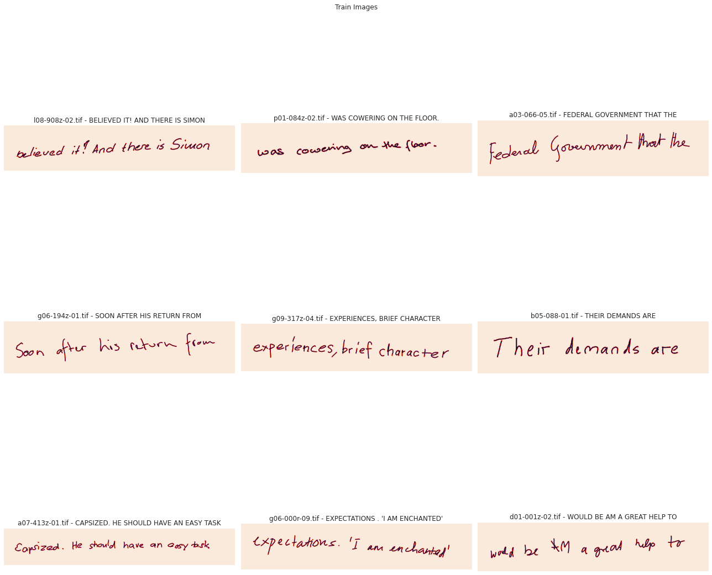
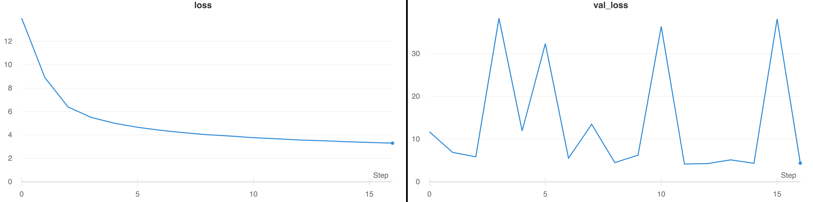
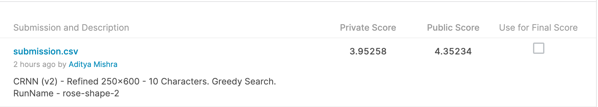

# Case Independent Handwritten Line Recognition

## Description
The goal of the competition is to create a model that correctly recognizes the handwritten text line present in the image.

## Evaluation
Evaluation Metric will be the Average Levenshtein Distance between the predictions and the ground truth.

## Raw Data
The data consists of images in "tif" format. Each image has a ground truth text file with the same name. For example, If the image is 1.tif the ground truth file would be 1.gt.txt

The images contain a line written in the english language and the length of the sentence or no. of words can vary. The text values are all in upper case and can also contain special characters.

Data Available Here - https://www.kaggle.com/c/arya-hw-lines/data



## [Are Multidimensional Recurrent Layers Really Necessary for Handwritten Text Recognition?](http://www.jpuigcerver.net/pubs/jpuigcerver_icdar2017.pdf)

### Architecture
**Convolutional Blocks**: 5 convolution blocks with each block containing a Conv2D layer, with `3x3` kernel size & stride 1. The number of filters at the `n-th` Conv layer is to `16n`. Dropout is applied at the input of last 2 conv blocks (prob=0.2). Batch Normalization is used to normalize the inputs to the nonlinear activation function. *LeakyReLU* is the activation function in the convolutional blocks. Finally, *Maxpool* with non-overlapping kernels
of `2×2` is applied.

**Recurrent Blocks**: Recurrent blocks are formed by bidirectional 1D-LSTM layers, that process the input image columnwise in left-to-right and right-to-left order. The output of the two directions
is concatenated depth-wise. Dropout is also applied(prob=0.5). Number of hidden units in all LSTM layers `256`. Total number of recurrent blocks is 5.

**Linear Layer**:  Finally, each column after the recurrent 1D-LSTM blocks must be mapped to an output label. The depth is transformed from `2D` to `L` using an affine transformation (L=characters+1)

### Parameters
1. RMSProp with learning rate - 0.0003
2. Batch Size = 16

### Augmentation
Rotation, Translation, Scaling and Shearing (all performed as a single affine transform) and gray-scale erosion and dilation. Each of these operations is applied dynamically and independently on
each image of the training batch (each with 0.5 probability). Thus, the exact same image is virtually never observed twice during training.


## Result
### Word Level - Training & Validation Loss


### Test Data Prediction


### Word Level Metrics
| Metric | Training | Validation |
--- | --- | ---
|Accuracy|0.8162|0.7392|
|Levenhstein Distance|0.3192|0.5001|
|Character Error Rate|7.2515|11.3602|

### Sentence Level Metrics
* Accuracy - 0.326 (Surprising?)
* Levenhstein Distance - 2.15
* Character Error Rate - 6.77

### Kaggle LeaderBoard


* Next Best Private LB - 4.54741
* Next Best Public LB - 4.29530

## TensorFlow Serving

Production ready model serving
* Part of TF Extended (TFX) Ecosystem
* Internally used at Google
* Highly scalable model serving solution
* Works well for models upto 2GB (sufficient for most cases)

> TF-Serving is not available for Windows or macOS. So, the only option is to use Docker
### Pulling Server Image
```bash
docker pull tensorflow/serving
```

### Running a serving image
The serving images (both CPU and GPU) have the following properties:

* Port 8500 exposed for gRPC
* Port 8501 exposed for the REST API
* `MODEL_NAME` env variable set to "handwritten_ocr". Defaults to "model"

### Serving with Docker
Inside the root directory.
```bash
docker run -d --name tfserving -p 8501:8501 \
  -v "$PWD/saved_model:/models/handwritten_ocr" \
  -e MODEL_NAME=handwritten_ocr -t tensorflow/serving
```
* `-d` - Runs in daemon mode
* `-p 8501:8501` - Maps port 8501 on host to container
* `--name tfserving`  - Name of the container
* `--mount` - Bind mounts the local folder on to the container. Allows accessing the saved model from within the container
* `-e` - Sets environment variable. Sets `MODEL_NAME` to "handwritten_ocr". This will form the part of URL endpoint
* `-t` - Docker image to use (tensorflow/serving here)

### REST
Tensorflow serving provides REST endpoint
* Standard HTTP Post requests
* Response is a JSON Body with the prediction
* Request from the default or specific model

Default URL structure - `http://localhost:8501/v1/models/{MODEL_NAME}`

A sample script which reads data from [Streamlit Drawable Canvas](https://github.com/andfanilo/streamlit-drawable-canvas) and sends it as a HTTP Post request to the deployed model -

```python
import streamlit as st
import streamlit_drawable_canvas as st_canvas

# Code to add drawable canvas. Refer link above
canvas_result = st_canvas(...)

# Read data
img = canvas_result.image_data

# Do something with the data
...

# Prepare headers & data to be sent in the POST request
json_data = json.dumps({"instances": img.tolist()})
headers = {"content-type": "application/json"}
# Send the request to the Prediction API
response = requests.post(endpoint, data=json_data, headers=headers)

# Decode the prediction
prediction = magic_decode_recipe(response.json()["predictions"])
print(f"Prediction: {prediction}")
```

### Multilple Versions
Here, I am serving multiple models. Create a `models.config` file with the following content -

```bash
model_config_list: {
    config: {
        name: "handwritten_ocr",
        base_path: "/models/handwritten_ocr/",
        model_platform: "tensorflow",
        model_version_policy: {specific: {versions: 1, versions: 2}}
    }
}
```
Then pass this filepath as an argument when creating docker container -

```bash
docker run -d --name tfserving -p 8501:8501 \
  -v "$PWD/saved_model:/models/handwritten_ocr" \
  -v "$PWD/models.config:/models/models.config" \
  -e MODEL_NAME=handwritten_ocr -t tensorflow/serving --model_config_file=/models/models.config
```

* HealtCheck URL - http://localhost:8501/v1/models/handwritten_ocr/versions/<version_number>
* Prediction URL - http://localhost:8501/v1/models/handwritten_ocr/versions/<version_number>:predict